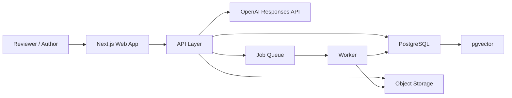

# Easy FEvIR Architecture

## Purpose

This document turns the current MVP into a buildable product architecture.

It answers five practical questions:

1. what stack we should use
2. where LLM extraction fits
3. where retrieval and RAG fit
4. how drafts should be stored and reviewed
5. how reviewed drafts should map into FEvIR / FHIR artifacts

## Product Position

Easy FEvIR should be an AI-assisted evidence authoring system.

It is not:

- a generic medical chatbot
- a full raw FHIR editor
- a pure document Q&A tool

Its core job is:

`source document -> structured draft -> human review -> FEvIR-aligned output`

## Architecture Principles

- Keep the human review step explicit.
- Use strict structured outputs for extraction.
- Use retrieval only when the system must search across a corpus.
- Preserve provenance for every generated field.
- Keep the frontend contract stable while backend internals evolve.
- Use one primary application language: TypeScript.
- Delay full FEvIR write integration until the canonical draft model is stable.

## Recommended Stack

### Frontend

- `Next.js`
- `React`
- `TypeScript`
- `App Router`

Why:

- good fit for the current 3-panel app
- clean server/client boundary
- easy auth, routing, and deployment later
- straightforward migration path from the current Vite prototype

### Backend API

- `Node.js`
- `TypeScript`
- route handlers or a small dedicated API service

Why:

- keeps the current backend code reusable
- shared types with the frontend
- simplest path from current MVP to production

### Database

- `PostgreSQL`
- `pgvector`

Why:

- relational storage for sources, drafts, snippets, approvals, and audit trails
- vector similarity for retrieval
- metadata filtering and joins in one system

### Object Storage

- `S3-compatible storage`

Use for:

- uploaded PDFs
- source files
- exported FEvIR payload snapshots
- ingestion artifacts

### AI Layer

- `OpenAI Responses API`
- `structured outputs` for extraction

Use for:

- `POST /api/v1/extract`
- `POST /api/v1/regenerate-field`

Not for:

- final publication approval
- silent certainty grading
- ungrounded summarization

### Background Jobs

- a queue-backed worker process

Use for:

- PDF text extraction
- chunking
- embedding generation
- index refresh
- export packaging

### Validation

- `Zod`
- JSON Schema

Use for:

- request validation
- LLM output validation
- canonical draft validation before export

## Recommended System Shape

## Subsystems

### 1. Web App

Responsibilities:

- source input
- field-by-field review
- snippet inspection
- approve / edit / regenerate
- local draft autosave
- authenticated draft loading later

Main UI:

- left: source panel
- center: review cards
- right: assembled draft

Primary workspace areas should eventually mirror FEvIR's own user entry points:

- `My Resources`
- `Search`
- `Create Recommendation`
- `Create Guideline`
- `Create Cohort Definition`
- `Create New Resource`
- `Citation Builder`
- `CodeableConcept Builder`
- `MEDLINE / ClinicalTrials.gov / RIS import`

The current 3-panel MVP fits inside `Create Recommendation`, but the full product should not be modeled as a single-screen extractor only.

### 2. API Layer

Responsibilities:

- keep current routes stable
- validate payloads
- call extraction pipeline
- persist draft state
- expose retrieval endpoints
- assemble export payloads

Current stable routes:

- `POST /api/v1/extract`
- `POST /api/v1/regenerate-field`

Likely next routes:

- `POST /api/v1/drafts`
- `GET /api/v1/drafts/:id`
- `PATCH /api/v1/drafts/:id/fields/:fieldKey`
- `POST /api/v1/retrieval/search`
- `POST /api/v1/exports/fevir`

### 3. Extraction Pipeline

This is the main authoring pipeline.

Flow:

1. receive one source document
2. normalize the source text
3. call the model with strict JSON schema
4. validate the model response
5. normalize snippets and confidence
6. fall back to heuristics if model call fails
7. return the 8 draft fields
8. log quality metrics for prompt iteration

The current API contract should stay unchanged while this gets better.

The Primer also implies an import-first workflow, not only a paste-text workflow.

That means the product should support these source entry modes:

- pasted text
- PMID / MEDLINE import
- ClinicalTrials.gov import
- RIS citation import
- PDF upload and extraction

### 4. Retrieval Pipeline

This is not the same thing as extraction.

Use retrieval only when the user needs context from a larger corpus.

Use cases:

- find similar existing recommendations
- suggest reusable FEvIR artifacts
- find likely duplicate sources
- bring in prior evidence for comparison
- search previously approved drafts

Retrieval should be hybrid:

- metadata filters
- full-text search
- vector similarity

## RAG Decision

Do **not** use RAG for every extraction call.

### No RAG

Use direct extraction when:

- the user pasted one abstract
- the user uploaded one paper
- the task is only `extract this document into the 8 fields`

Why:

- the source is already in hand
- retrieval adds latency and failure modes
- it makes grounding harder to reason about

### Use Retrieval / RAG

Use retrieval when:

- the system needs to search prior knowledge
- the user wants reuse suggestions
- the user asks questions over multiple stored documents
- the system is trying to link a draft to existing FEvIR-like resources

### Practical Rule

Use:

- `single source -> structured extraction`
- `multi-source or corpus question -> hybrid retrieval + grounded synthesis`

## Canonical Draft Model

Do not store only raw FHIR JSON.

Use an internal canonical draft model first, then map it to FEvIR/FHIR resources.

Canonical draft fields:

- `title`
- `population`
- `intervention_comparator`
- `outcomes`
- `evidence_summary`
- `recommendation_statement`
- `justification`
- `references`

Each field should store:

- value
- status
- confidence
- source snippets
- generated-by metadata
- edited-by metadata
- timestamps

For recommendations, the canonical model should be allowed to grow beyond the current 8 MVP fields.

The Primer explicitly calls out these recommendation sections:

- recommendation statement
- recommendation ratings
- population
- action / opposite action
- evidence
- justification and considerations
- methods
- references
- competing interests
- acknowledgements
- appendices

The MVP should keep the 8-field surface, but the data model should not block these later sections.

## Reusable Resource Library

One of the clearest things we underweighted on the first pass is reusability.

Easy FEvIR should not treat every draft as isolated text generation. It should build a reusable library of:

- populations
- interventions / comparators
- outcomes
- citations
- evidence artifacts
- codeable concepts

This means we need first-class support for:

- resource reuse
- search before create
- deduplication
- linking narrative sections to underlying resources
- personal and team workspaces such as `My Resources`

## Data Model

Recommended core tables:

### `sources`

Stores the uploaded or pasted source.

Suggested columns:

- `id`
- `type`
- `title`
- `source_id`
- `raw_text`
- `storage_key`
- `checksum`
- `created_at`

### `source_chunks`

Stores chunked text for retrieval and grounding.

Suggested columns:

- `id`
- `source_id`
- `chunk_index`
- `text`
- `token_count`
- `embedding`
- `created_at`

### `drafts`

One draft session per recommendation authoring workflow.

Suggested columns:

- `id`
- `source_id`
- `status`
- `created_by`
- `created_at`
- `updated_at`

### `draft_fields`

Stores each current field state.

Suggested columns:

- `id`
- `draft_id`
- `field_key`
- `label`
- `value`
- `status`
- `confidence`
- `generation_mode`
- `last_generated_at`
- `last_edited_at`

### `draft_field_snippets`

Stores grounding for each field.

Suggested columns:

- `id`
- `draft_field_id`
- `source_id`
- `snippet_text`
- `start_offset`
- `end_offset`
- `sort_order`

### `draft_events`

Audit trail for review actions.

Suggested columns:

- `id`
- `draft_id`
- `field_key`
- `event_type`
- `actor_id`
- `payload`
- `created_at`

### `published_artifacts`

Stores FEvIR/FHIR-shaped exports and publication state.

Suggested columns:

- `id`
- `draft_id`
- `artifact_type`
- `payload_json`
- `publication_status`
- `published_at`

### `resource_library_entries`

Stores reusable FEvIR-aligned resource references and normalized metadata.

Suggested columns:

- `id`
- `resource_type`
- `profile_name`
- `title`
- `canonical_key`
- `source_draft_id`
- `payload_json`
- `status`
- `created_at`

### `artifact_assessments`

Stores comments, ratings, and review metadata for governance.

Suggested columns:

- `id`
- `resource_library_entry_id`
- `assessment_type`
- `rating`
- `comment`
- `actor_id`
- `created_at`

## Main Flows

### Flow 1: Single-Source Extraction

1. user enters source text
2. API stores source
3. API calls structured extraction
4. API returns the 8 fields with snippets
5. frontend renders review cards

This flow does not need retrieval.

### Flow 2: Field Regeneration

1. user regenerates one field
2. API sends source plus current field context
3. model returns only the target field
4. API validates and stores the new field version
5. frontend updates only that card

### Flow 3: Retrieval-Assisted Reuse

1. user opens a draft
2. API searches stored drafts, sources, and published artifacts
3. system returns similar matches
4. user chooses reuse, ignore, or compare

This is the right place for hybrid retrieval.

### Flow 3a: Import-First Evidence Ingestion

The PRECLUDE case study shows that many workflows start with citation import, not freeform authoring.

Practical sequence:

1. import a citation from PMID or another external source
2. create a `Composition`-like report container for the study or evidence package
3. create or link `Group` / `StudyGroup` resources for the population
4. add variables, evidence, and comparative findings
5. reuse those assets when building recommendations later

This means recommendation authoring and study-ingestion authoring are related but not identical workflows.

### Flow 4: FEvIR Export

1. user completes review
2. API validates required draft fields
3. mapper converts canonical draft to FEvIR/FHIR resource shapes
4. export is stored and downloaded or submitted later

## FEvIR / FHIR Mapping Strategy

Do not make authors work directly in raw FHIR resources.

Use a mapper layer from canonical draft data into FEvIR-aligned resources.

Likely target resources:

- `Citation`
- `Evidence`
- `EvidenceVariable`
- `Group`
- `Composition`
- `PlanDefinition`
- `ArtifactAssessment`
- `CodeSystem` / coded terminology references
- related artifact references where needed

The PRECLUDE case study also suggests a practical container model:

- `Composition` profiles such as `ComparativeEvidenceReport` act as binders for study-level evidence packages
- `Recommendation` acts as a container for recommendation-level content
- `PlanDefinition` and `ActivityDefinition` represent the executable recommendation structure

So we should expect at least two distinct authoring modes:

- study or evidence package authoring
- recommendation or guideline authoring

## Terminology and Coding

The Primer gives more weight to coded terminology than we did on the first pass.

We should plan for:

- reusable `CodeableConcept` creation
- terminology-backed intervention and outcome coding
- SEVCO-aligned evidence terminology where possible

This is important for:

- consistent reuse
- search quality
- analytics
- interoperability

The MVP can keep free text with snippets, but later versions should attach normalized codes when available.

## Governance and Review

The Primer is explicit that FEvIR is not just authoring; it also supports governance.

We should plan for:

- draft vs active states
- artifact assessments
- change reports
- structured comments
- consensus and review workflows

The MVP does not need ballots or committee tooling, but the audit/event model should leave room for them.

The mapper should:

- keep source provenance
- keep field-to-resource traceability
- validate required references
- avoid hidden transformations

## Prompting Strategy

Use one extraction prompt family and version it.

Prompt rules:

- only use supplied source text
- no invented certainty or effect sizes
- snippets must be verbatim
- return only schema-valid JSON
- keep recommendation language conservative

Recommended prompt families:

- `extract-v1`
- `regenerate-field-v1`
- later: `retrieval-synthesis-v1`

Every response should log:

- prompt version
- model
- latency
- field completeness
- snippet count
- fallback reason

## Logging and Evaluation

Log to structured JSON, not plain text.

Track:

- request id
- route
- extraction mode
- model
- duration
- source length
- populated fields
- grounded fields
- warning count
- average confidence
- fallback usage

Evaluation set:

- keep 10 to 20 fixed source documents
- compare output quality across prompt versions
- review false claims and weak grounding

## Security and Compliance

This is healthcare-adjacent, so be conservative early.

Rules:

- avoid PHI in demo data
- store uploaded files separately from app servers
- redact logs if real-world content is used later
- keep model calls auditable
- require explicit human review before publication

Do not market this as autonomous clinical decision-making.

## Deployment Recommendation

For the first real hosted version:

- `Next.js app`
- `Node API`
- `Postgres + pgvector`
- `S3-compatible storage`
- one worker process

That is enough.

Do not split into microservices yet.

## Implementation Phases

### Phase 1: Real Extraction

Goal:

- keep current UI
- make extraction model-backed
- keep heuristic fallback
- improve logs and prompt iteration

### Phase 2: Persistent Drafts

Goal:

- store sources
- store drafts and field states
- store snippets and audit events
- replace browser-only persistence
- support `draft` and later `active` publication states

### Phase 3: Hybrid Retrieval

Goal:

- full-text search
- vector similarity
- reuse suggestions
- duplicate detection
- search-before-create behavior for reusable resources

### Phase 4: FEvIR Export

Goal:

- canonical draft validation
- FEvIR/FHIR mapper
- downloadable export payload
- optional FEvIR API integration later
- support both recommendation exports and study/evidence package exports

## Immediate Build Recommendation

The next practical implementation order should be:

1. keep the current frontend contract
2. keep the current 3-panel workflow
3. add persistent `sources`, `drafts`, and `draft_fields`
4. keep improving the LLM extraction path
5. add hybrid retrieval only after persistence exists
6. add FEvIR export after the canonical draft model is stable

## Final Stack Decision

If we commit now, the stack should be:

- `Next.js + React + TypeScript`
- `Node.js API in TypeScript`
- `PostgreSQL`
- `pgvector`
- `S3-compatible storage`
- `OpenAI Responses API`
- `structured outputs`
- `queue-backed worker`

And the RAG decision should be:

- `No` for basic single-document extraction
- `Yes` for corpus search, reuse, and multi-source synthesis
